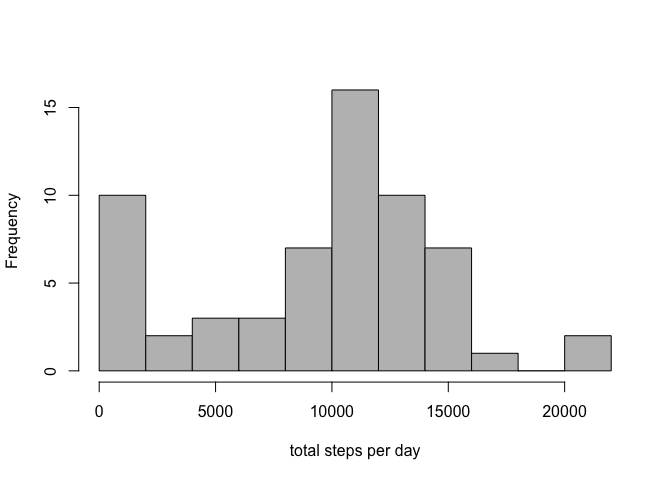
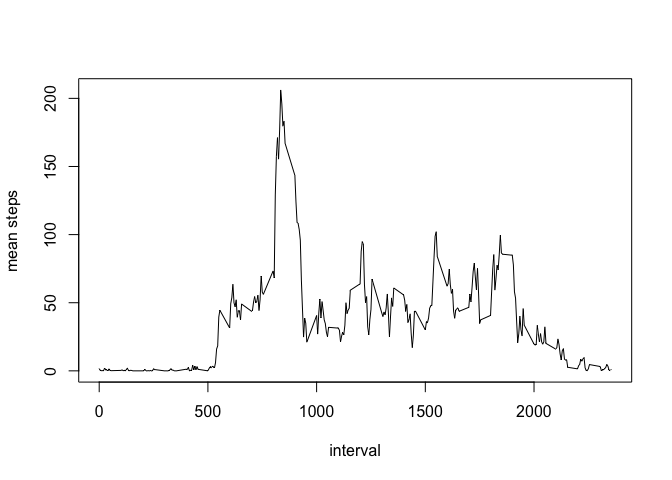
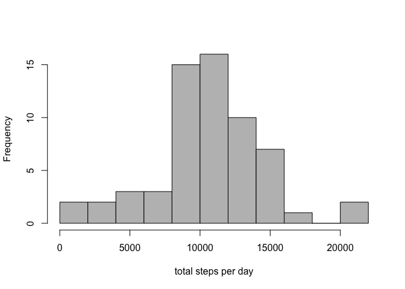
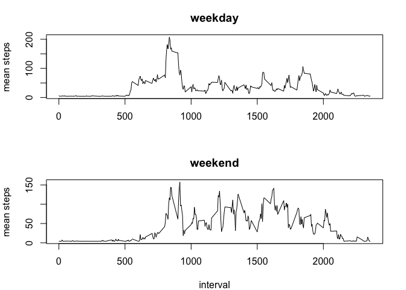

## Load packages

```r
library(dplyr)
```

```
## 
## Attaching package: 'dplyr'
```

```
## The following objects are masked from 'package:stats':
## 
##     filter, lag
```

```
## The following objects are masked from 'package:base':
## 
##     intersect, setdiff, setequal, union
```

## Loading and preprocessing the data

```r
unzip("activity.zip")
activity <- read.csv("activity.csv", colClasses = c("numeric","Date","numeric"))
```

## What is mean total number of steps taken per day?

```r
#calculate daily sums and plot histogram
dailysums <- summarize(group_by(activity, date), sum = sum(steps, na.rm = T))
hist(dailysums$sum, xlab = "total steps per day", main = "", breaks = 10, col = "grey")
```

<!-- -->

```r
#calculate mean and median
activity_mm <- list(mean = mean(dailysums$sum, na.rm = T), median = median(dailysums$sum, na.rm =T)) 
activity_mm
```

```
## $mean
## [1] 9354.23
## 
## $median
## [1] 10395
```
The mean number of steps per day is 9354.2295082.  
The median number of step per day is 1.0395\times 10^{4}.

## What is the average daily activity pattern?

```r
#calculate and plot interval means
intervalmeans <- summarize(group_by(activity, interval), mean = mean(steps, na.rm = T))
plot(intervalmeans$interval, intervalmeans$mean, xlab = "interval", ylab = "mean steps", main = "", type = "l")
```

<!-- -->

```r
#find interval with max mean
maxsteps <- filter(intervalmeans, intervalmeans$mean == max(intervalmeans$mean, na.rm = T))[,1] 
maxsteps
```

```
## # A tibble: 1 x 1
##   interval
##      <dbl>
## 1      835
```
The interval with the max number of steps is 835.

## Imputing missing values

```r
#calculate number of missing rows
NAsteps <- is.na(activity$steps)
sumNA <- sum(NAsteps)
sumNA
```

```
## [1] 2304
```
There are 2304 rows with missing step values.  


```r
act_imputed <- activity #copy df
act_imputed [NAsteps,1] <- activity_mm$mean/nrow(intervalmeans) #impute NAs with mean for all intervals

#compute and plot sums as hist
ai_dailysums <- summarize(group_by(act_imputed, date), sum = sum(steps, na.rm = T))
hist(ai_dailysums$sum, xlab = "total steps per day", main = "", breaks = 10, col = "grey")
```

<!-- -->

```r
#calculate mean and median
ai_mm <- list(mean = mean(ai_dailysums$sum, na.rm = T), median = median(ai_dailysums$sum, na.rm =T)) 

#compare mean and median to original dataset
mean_diff <- ai_mm$mean - activity_mm$mean
median_diff <- ai_mm$median - activity_mm$median
if (mean_diff != 0){
        if (mean_diff >0){mean_message = paste(mean_diff, "greater than")
        }else{mean_message = paste(-1*mean_diff, "less than")
        }
}else{mean_message = paste("the same as")
}
        
if (median_diff != 0){
        if (median_diff >0){median_message = paste(median_diff, "greater than")
        }else{median_message = paste(-1*median_diff, "less than")
        }
}else{median_message = paste("the same as")
}

ai_mm
```

```
## $mean
## [1] 10581.01
## 
## $median
## [1] 10395
```
The mean number of steps per day for the imputed dataset is 1.0581014\times 10^{4}.   
This is 1226.78419779629 greater than the mean for the original dataset.   
The median number of steps per day is 1.0395\times 10^{4}.  
This is the same as the median for the original dataset.   
Imputing the missing values in this way normalizes the data bringing the mean closer to the median.  

## Are there differences in activity patterns between weekdays and weekends?

```r
#add factor variable with two levels for weekend and weekday
days <-weekdays(act_imputed[,2], abbreviate = T)
days <- gsub("Mon|Tue|Wed|Thu|Fri", "weekday", days)
days <- gsub("Sat|Sun", "weekend", days) 
act_imputed <- cbind(act_imputed, days)

#calculate interval means
calc_int_means <- function(d) { act_imputed %>%
        filter(days == d) %>%
        group_by(interval) %>%
        summarize(mean = mean(steps))
}

weekday_intervalmeans <- calc_int_means (d="weekday")
weekend_intervalmeans <- calc_int_means (d="weekend")
        
#plot interval means
par(mfcol = c(2,1), mar = c(4,4,3,2))
with(weekday_intervalmeans, plot(interval, mean, xlab = "", ylab = "mean steps", main = "weekday", type = "l"))
with(weekend_intervalmeans, plot(interval, mean, xlab = "interval", ylab = "mean steps", main = "weekend",type = "l"))
```

<!-- -->
  
  Comparing the graphs it seems like the subjects were more active on the weekends.
