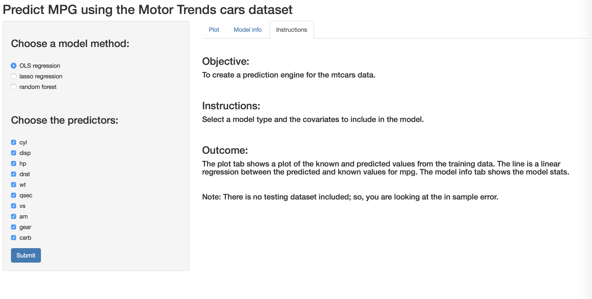
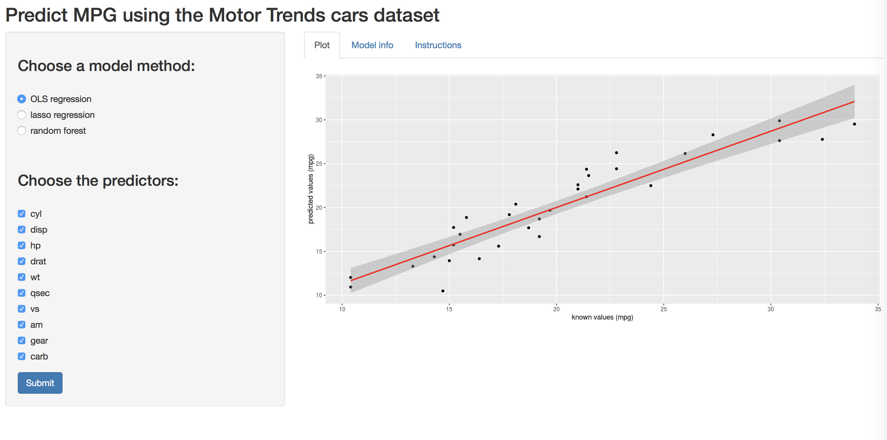
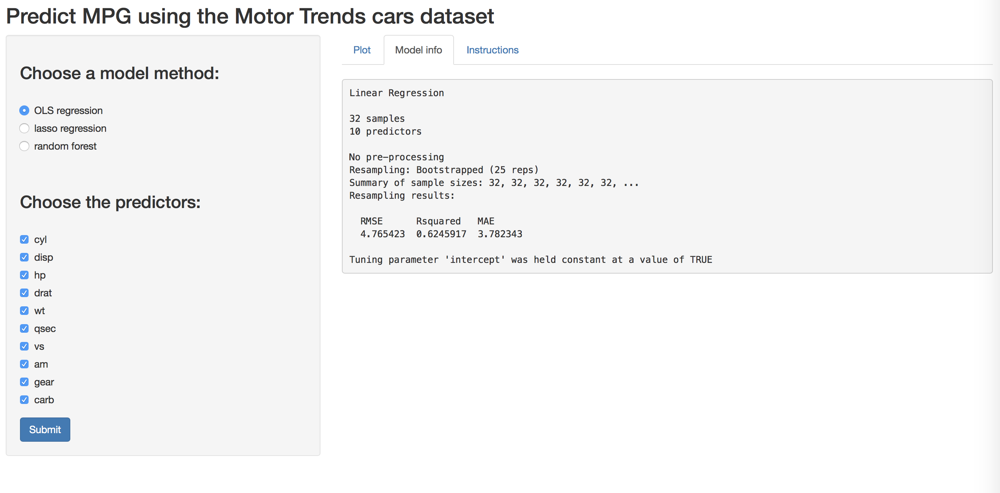

```{r setup, include=FALSE}
knitr::opts_chunk$set(echo = FALSE)
```

## Introduction
I desgined an app that predicts mpg from the other variables in the mtcars dataset. It allows you to select the model type and covariates to include in the model. It then returns a plot of the predicted and known mpg and includes a linear regression line. It also returns the model statistics. This allows you to quickly change the model and address which variables to include. The app can be found at <https://jdberndt.shinyapps.io/predict_cars/>. The github repo can be found here <https://github.com/jdberndt/datasciencecoursera/tree/master/predict_cars>. See "five_slide_pitch.Rmd" to view source code for these slides.


## Screen shot
```{r, out.width = "800px"}

```

## Example Plot Output

```{r, out.width = "800px"}

```

## Example Model Info Output

```{r, out.width = "800px"}

```
