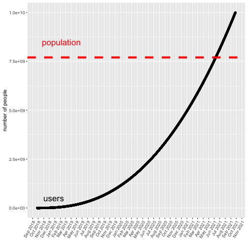

WordPicker Pro Edition
========================================================
author: Jason B.
date: 9/26/2018
autosize: true

The world is in grammatical chaos
========================================================
- Do you have trouble finding just the right words to type?
- Does clicking and tapping irritate your arthritis?
- Do you prefer to send embarassing texts due to auto-completion errors?  

If so, then WordPicker Pro is the answer for you!
========================================================
- It's easy to use.
- It gets the right word every time.*
- There is no annual fee.

\*result may vary

WordPicker Pro
========================================================
We developed WordPicker Pro as the **ultimate** solution to the world's autocomplete needs. Our analysis suggests that the total number of users will exceed Earth's population within three years. So, get in on the ground floor, invest now.  
 

Summary
========================================================
Find the prototype of our amazing app by following the link below:  
[WordPickerPro on shinyapps.io] (https://www.shinyapps.io/admin/#/application/470320)  
Some limitations may apply:  
- R is not the best language for iOS or Android application development.
- The text used as the basis for the predictions is old and somewhat irrelevant.
- We were not able to implement tab-completion; so you'll have to type the word you want anyway.
- The algorithm is overly simplistic due to limitations of the shinyapps.io server.
- Our competitors consist of large teams of developers with years of experience.
- Usage growth after 2021 is entirely dependent on contact with extraterrestrial beings or a massive population boom.  
   
Thanks for taking time to review my assignment and provide feedback. Have a great life.  

